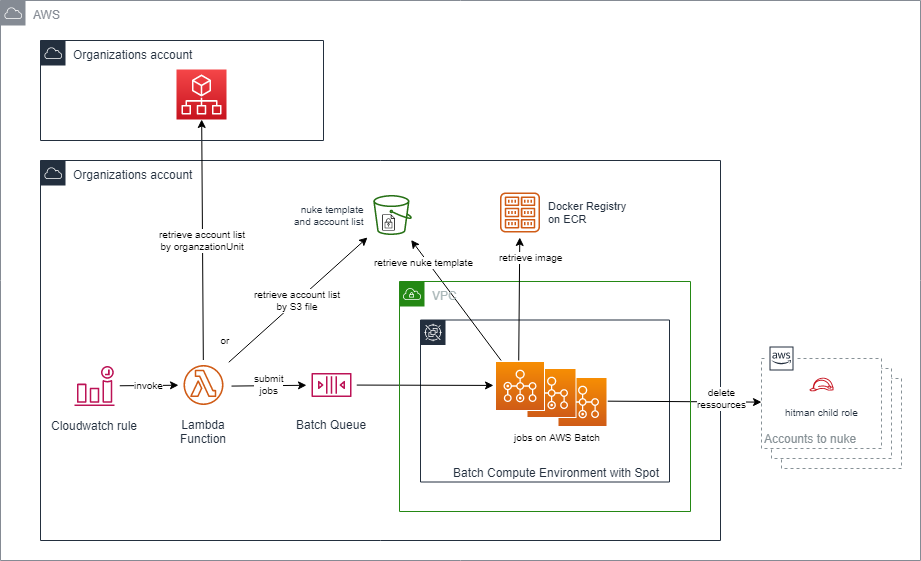

# Hitman

Hitman is an AWS account content killer specialist.

## Description

People often need to delete training, POC, learning AWS accounts. Hitman is here to do the job for you at a defined frenquency.
It ensures cost containment and security hardening.

## Technicals details

Hitman is based on the great [aws-nuke](https://github.com/rebuy-de/aws-nuke).
It simply industrializes the deletion process thanks to the following AWS ressources :
- CloudWatch Rule to trigger the deletion execution
- Batch to ensure a pay per use strategy
- ECR to host the Docker image that embeds aw-nuke
- Lambda to gather the accounts to nuke and submit the jobs
- S3 to store some configuration
- Cloudwatch Logs to log the global acitivity

## Prerequisites

Hitman needs :
- a VPC
- a private subnet

## Installation

1. deploy the cf-hitman-common.yml Cloudformation stack in the central account
2. build, tag and push the Docker image. Follow the information provided in the ECR repository page.
3. add the list of accounts to nuke in accounts.list file
4. customize awsnuke-config-template.yaml :
   - add in the blacklist part the accounts you will never want to nuke
   - add the resources you to not want to delete. Keep the role by Hitman to delete resources
5. upload both the accounts.list and awsnuke-config-template.yaml files in the create S3 bucket
6. deploy the cf-hitman-batch.yml Cloudformation stack in the central account
7. in each spoke account (or once we a Stackset), deploy cf-hitman-spoke-account.yml to deploy the need role to assume

## Warning

Please pay an extrem attention to the account list to nuke ... and do not forget to blacklist usefull account.

